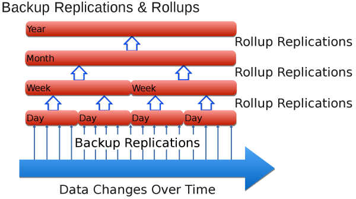
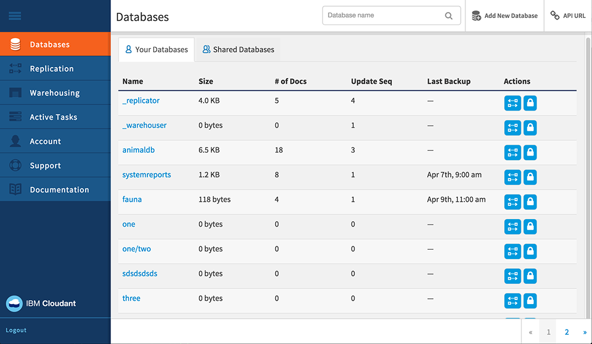
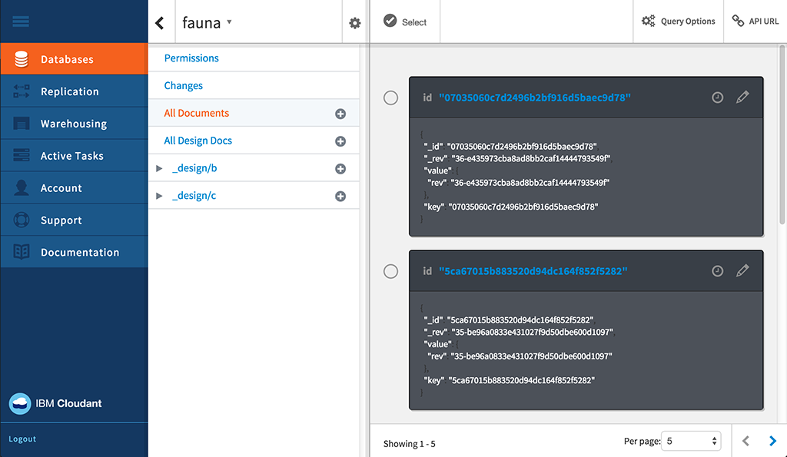
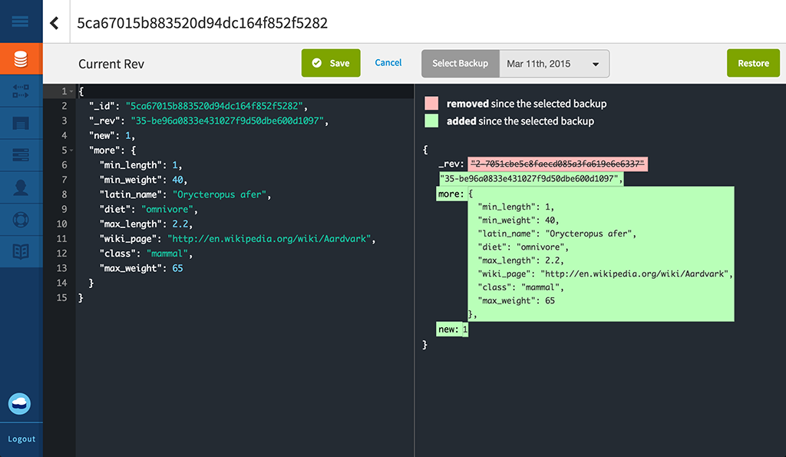

---

copyright:
  years: 2015, 2017
lastupdated: "2017-01-06"

---

{:new_window: target="_blank"}
{:shortdesc: .shortdesc}
{:screen: .screen}
{:codeblock: .codeblock}
{:pre: .pre}

# Back up your data

>   **Note**: This guide refers to a *Beta* daily incremental backup capability,
    available only on request to Enterprise customers.

This capability:
-   Is not enabled by default.
-   Is only available to Enterprise customers, who must specifically request it.
-   Must be explicitly configured before it is operational.
-   Is subject to [known limitations](#known-limitations).
-   Is not applicable to [Cloudant Local](https://www.ibm.com/support/knowledgecenter/SSTPQH_1.0.0/com.ibm.cloudant.local.doc/SSTPQH_1.0.0_welcome.html){:new_window}.
For more information,
please contact the [IBM Cloudant support team](mailto:support@cloudant.com){:new_window}.

>   **Note**: The daily incremental backup capability is not applicable for
    [Cloudant Local](https://www.ibm.com/support/knowledgecenter/SSTPQH_1.0.0/com.ibm.cloudant.local.doc/SSTPQH_1.0.0_welcome.html){:new_window}.
    To back up data in Cloudant Local,
    use [replication](../api/replication.html) to make a copy of your database.

To ensure high availability,
{{site.data.keyword.cloudant}} creates three copies of each document,
and stores it on three different servers in a cluster.
This practice is the default for all Cloudant users.
Even when your data is replicated in triplicate,
it is still  important to back it up.

Why is backing up important?
In general,
you could lose access to data in many ways.
For example,
if a hurricane destroys your data center and all three nodes are in that location,
you lose your data.
You can prevent the loss of your data in a disaster by replicating your data to a
cluster (dedicated or multi-tenant) in a different geographic location.
However,
if a faulty application deletes or overwrites the data in your database,
duplicate data is not helpful.

Having a comprehensive,
tested backup enables you to answer the following question with confidence:
"How can we restore data in case of loss or corruption?"

With Cloudant,
Enterprise customers can have daily incremental backups.

If you are not an Enterprise customer,
or you wish to create your own backup mechanism,
consider [using Replication to perform backups](backup-guide-using-replication.html).

>   **Note**: Daily incremental backup for Enterprise customers is currently a *Beta* capability.
    It is not enabled by default.

Daily incremental backups or 'deltas' enable document comparison,
and easier single document restoration.
At regular intervals,
which can be configured,
the smaller daily deltas are rolled up into weekly deltas.
Similarly,
weekly deltas are rolled up into monthly deltas,
and monthly deltas into yearly ones.
This process of rolling up deltas is a pragmatic compromise between
being able to restore exactly the correct version of a document,
and requiring a lot of storage space.

The backup facility allows you to restore individual documents manually.
Should you wish to restore and entire database,
for example as part of a disaster recovery scenario,
you can contact the support team and have your data restored to a specific day,
week,
month or year,
subject to the deltas you have available.

More information about how Cloudant backs up data is provided in the rest of this topic.
For further assistance,
or to request that data backup is enabled,
contact the Cloudant support team:
[support@cloudant.com](mailto:support@cloudant.com){:new_window}.

>   **Note**: The Cloudant backup facility is available only to Enterprise customers.

>   **Note**: By default,
    `_design` documents are not backed up,
    so that indexes are _not_ built on the incremental backup databases.
    If you require backups of the `_design` documents,
    you must maintain them in your preferred source control tool.

## Concepts

It is helpful to understand the following terms when referring to backup concepts:

Term                 | Meaning
---------------------|--------
Backup cleanup       | When a delta database has been rolled up, the delta database is removed after a configurable time period. This allows you to balance data retention at a high granularity against the cost of storage.
Backup rollup        | Daily backups are combined into weekly rolled up databases. These combine the daily deltas into a coarser (less granular) backup. Similarly, weekly databases are rolled up into monthly databases, and monthly databases into yearly databases.
Backup run           | For a backup period, the source database is replicated using sequence values to determine the documents that changed during the backup period. On completion, this replication is called the daily backup.
Baseline backup      | A collection of documents, against which a delta database can be compared.
Daily backup         | See Backup run.
Daily delta          | Another name for a daily backup.
Delta database       | The collection of documents that have changed over a period of time (the 'delta').
High/low granularity | This indicates how precisely you can specify the period of change for a document. A high granularity rollup has a short timescale for the period of change, for example a day in the case of a daily backup. A low granularity rollup has a long timescale for the period of change, for example a year in the case of a yearly backup.
Incremental backup   | The collection of documents that have changed in the database since the last backup.
Roll up              | Aggregate a collection of incremental backups into a lower granularity backup, for example to aggregate the daily backups for a week into a single 'weekly' backup.

## Incremental backups

The first step in enabling incremental backups is to take a full backup of your entire database.
This provides a 'baseline' for the subsequent incremental backups.

Every day,
after the first 'baseline' backup,
a daily,
incremental backup is taken.
This daily incremental backup contains only the data that has changed in the database since the last backup.
The daily backup is the 'daily delta'.

As part of the request to enable data backups,
you can specific a time of day for the backup to run.
The daily delta is created each day,
at the time you specified.

## Roll ups

A roll up combines daily backups into weekly,
rolled up databases.
These roll up databases combine the daily deltas into a coarser,
or 'less granular',
time slice.
Weekly databases roll up into monthly databases,
and monthly databases roll up into yearly databases.



When requesting that backups are enabled,
you should specify how many daily deltas to keep.
Once that number is reached,
the oldest daily delta is rolled up into the most recent weekly database.
Thereafter,
the weekly databases are rolled up to create the monthly databases,
and so on.

Once the delta databases have been rolled up,
they are removed to free up storage space.

## Restores

When you have backups for a database,
you can view individual documents within that database,
and also see changes made to that document.
You can also restore the document to the version that was current on a particular date,
if it is available within the granularity of the delta.

>   **Note**: Documents must be static before restoring from backup.
    In other words,
    the document should not be constantly receiving changes and updates.

For more complex restores,
such as a full database restore,
request assistance from [Cloudant support](mailto:support@cloudant.com){:new_window}.

## Using the Dashboard

Enterprise customers can review the status and history of backups using the Cloudant Dashboard.

Tasks you can perform include:

-   View the status of the last backup,
    including its date and time.
-   View a list of backup document versions by date and time.
-   View a current document and the difference between it and any backed up version.
-   Restore a document from a backed up version.

### Viewing database backup status



When you select the Database tab within the Cloudant Dashboard,
you can see a backup status column for each of your databases.

### Viewing document backup status



Within a database,
you can view the backup status of a specific document.
To do this,
first check to see if there is a backup icon
()
for your document.
This shows whether the specific document is included within the backup task.

When you select the document,
you can see a backup tab.


### Viewing differences between document backup versions, and restoring



When you click the backup tab for a document,
you can see the differences between the current version of the document,
and any other backed-up version.

If you decide that you would like to restore a specific backup version of that document,
simply select the date of the backup to restore,
then click the 'Restore' button.

>   **Note**: Documents must be in a stable state before restoring from backup.
    In other words,
    the document should not be constantly receiving changes and updates.

## Using the API

A number of REST API calls are available for working with the Cloudant backup facility.

### Task configuration

The `task` call gets the backup task configuration for the user.

You can specify the format used in the response by using the `format` parameter.

_Example of requesting the backup task configuration for the user,
returning results in a list format (default), using HTTP:_

```http
GET /_api/v2/backup/task HTTP/1.1
```
{:codeblock}

_Example of requesting the backup task configuration for the user,
returning results in a list format (default), using the command line:_

```shell
curl https://$USERNAME.cloudant.com/_api/v2/backup/task \
    -X GET
```
{:codeblock}

_Example of requesting the backup task configuration for the user,
returning results in a mapping format, using HTTP:_

```http
GET /_api/v2/backup/task?format=mapping HTTP/1.1
```
{:codeblock}

_Example of requesting the backup task configuration for the user,
returning results in a mapping format, using the command line:_

```shell
curl https://$USERNAME.cloudant.com/_api/v2/backup/task?format=mapping \
     -X GET
```
{:codeblock}

The default response format is a list.
You can request this format directly by using the `...backup/task?format=list` parameter.
The response contains a simple list of the backup tasks defined for the user.

For example,
you might request a list format response using either of the following commands:

```http
https://$USERNAME.cloudant.com/_api/v2/backup/task

https://$USERNAME.cloudant.com/_api/v2/backup/task?format=list
```
{:codeblock}

_Example response following a list format request:_

```json
{
    "rows": [
        {
            "username": "$USERNAME",
            "task": "backup-0d0b0cf1b0ea42179f9c082ddc5e07cb",
            "source_db": "backmeup",
            "latest_completion": null
        },
        {
            "username": "$USERNAME",
            "task": "backup-d0ea6e8218074699a562af543db66615",
            "source_db": "backuptest",
            "latest_completion": "2016-01-17T05:57:44+00:00"
        },
        {
            "username": "$USERNAME",
            "task": "backup-24cd8359b94640be85b7d4071921e781",
            "source_db": "taskdb",
            "latest_completion": "2016-01-17T00:01:04+00:00"
        }
    ]
}
```
{:codeblock}

A more comprehensive response is available in the mapping format.
You can request this format directly by using the `...backup/task?format=mapping` parameter.

For example, you might request a mapping format response using the following command:

```http
https://$USERNAME.cloudant.com/_api/v2/backup/task?format=mapping
```
{:codeblock}

_Example response following a mapping format request:_

```json
{
    "backmeup": {
        "username": "$USERNAME",
        "task": "backup-0d0b0cf1b0ea42179f9c082ddc5e07cb",
        "source_db": "backmeup",
        "latest_completion": null
    },
    "backuptest": {
        "username": "$USERNAME",
        "task": "backup-d0ea6e8218074699a562af543db66615",
        "source_db": "backuptest",
        "latest_completion": "2016-01-17T05:57:44+00:00"
    },
    "taskdb": {
        "username": "$USERNAME",
        "task": "backup-24cd8359b94640be85b7d4071921e781",
        "source_db": "taskdb",
        "latest_completion": "2016-01-17T00:01:04+00:00"
    }
}
```
{:codeblock}

### Determining backup tasks for specific databases

The `databases` parameter for the `task` request is used
to find what backup tasks are associated with a specified database.

The response lists the backup task details for the database identified in the `source_db` field.
The `task` identified can be used in other backup API calls,
such as the [database listing](#list-of-databases).

_Example command to find backup tasks for the `backuptest` and `taskdb` database, using HTTP:_

```http
GET /_api/v2/backup/task?databases=backuptest,taskdb HTTP/1.1
```
{:codeblock}

_Example command to find backup tasks for the `backuptest` and `taskdb` database, using the command line:_

```shell
curl https://$USERNAME.cloudant.com/_api/v2/backup/task?databases=backuptest,taskdb \
    -X GET
```
{:codeblock}

_Example response to finding backup tasks for specific databases:_

```json
{
    "rows": [
        {
            "username": "$USERNAME",
            "task": "backup-d0ea6e8218074699a562af543db66615",
            "source_db": "backuptest",
            "latest_completion": "2016-01-17T05:57:44+00:00"
        },
        {
            "username": "$USERNAME",
            "task": "backup-24cd8359b94640be85b7d4071921e781",
            "source_db": "taskdb",
            "latest_completion": "2016-01-17T00:01:04+00:00"
        }
    ]
}
```
{:codeblock}

### List of databases

The `monitor` request gets a list of the databases created by the backup task `$TASKNAME`,
that also contain the document `$DOCID`.

The request supports an optional argument: `include_docs`.
The default value is `false`.
If set to `true`,
the `monitor` request returns the full document content for each backup database containing `$DOCID`.

_Retrieving the list of databases created by a backup task, that contain a specific document, using HTTP:_

```http
GET /_api/v2/backup/monitor/$TASKNAME/$DOCID?include_docs=true HTTP/1.1
```
{:codeblock}

_Retrieving the list of databases created by a backup task, that contain a specific document, using the command line:_

```shell
curl https://$USERNAME.cloudant.com/_api/v2/backup/monitor/$TASKNAME/$DOCID?include_docs=true \
    -X GET
```
{:codeblock}

### Restore a document

The `restore` call replaces a document,
identified by `$DOCID`,
from a source database.
The source database is identified by the `$TASKNAME`.
The `$TASKDATE` is the timestamp of the specific backup,
and specifies when the backup was performed.
The `$FREQUENCY` is one of the following four values:
-   `"daily"`
-   `"weekly"`
-    `"monthly"`
-   `"yearly"`

>   **Note**: Documents must be in a stable state before restoring from backup.
    In other words,
    the document should not be receiving any changes and updates while the restore is in progress.

_Example of request to restore a document, using HTTP:_

```http
POST /_api/v2/backup/restore/document --data=@RESTORE.json HTTP/1.1
Content-Type: application/json
```
{:codeblock}

_Example of request to restore a document from the most recent version held in a specific backup database, using the command line:_

```shell
curl https://$USERNAME.cloudant.com/_api/v2/backup/restore/document --data=@RESTORE.json \
    -X POS \
    -H "Content-Type: application/json" \
    -d "$JSON"
```
{:codeblock}

_Example of a JSON document requesting that a document be restored
from the most recent version held in a specific backup database:_

```json
{
    "doc_id": $DOCID,
    "task_name": $TASKNAME,
    "task_date": $TASKDATE,
    "frequency": $FREQUENCY
}
```
{:codeblock}

## How backup using incremental replication works

A very simple form of backup is to [replicate](../api/replication.html) the database to a dated backup database.

This method works and is easy to do.
But if the database is big and you need backups for multiple points in time,
for example seven daily backups and four weekly ones,
you end up storing a complete copy of all the documents in each new backup database.
This is likely to require a lot of storage space.

Incremental backups are a good solution for storing only the documents that have changed since the last backup.

Initially,
you perform a backup of the entire database.
After the first backup,
you run regular,
incremental backups,
backing up only what has changed in the database since the last backup.
Typically these incremental backups take place once a day,
so this replication is a daily backup.

Incremental backups save only the delta between backups.
At regular intervals,
the source database is replicated to a target database.
Replication uses sequence values to identify the documents changed during the interval period.

The backup operation uses replication to get and store a checkpoint.
This checkpoint is another database with an internal name.

The replication process for a database starts by finding the value of the `since_seq` parameter.
The parameter indicates where the last replication finished.

The following steps outline how incremental backups are created:

1.  [Find the ID of the checkpoint document for the last replication.](#find-the-id-of-the-checkpoint-document-for-the-last-replication)
2.  [Get the `recorded_seq` value.](#get-the-recorded_seq-value)
3.  [Run an incremental backup.](#run-an-incremental-backup)

### Find the ID of the checkpoint document for the last replication

The checkpoint ID value is stored in the `_replication_id` field
of the replication document in the `_replicator` database.

_Example request to get the checkpoint ID of the last incremental backup,
for a database called `original`, using HTTP:_

```http
GET /_replicator/original HTTP/1.1
```
{:codeblock}

_Example request to get the checkpoint ID of the last incremental backup,
for a database called `original`, using the command line:_

```shell
replication_id=$(curl "${url}/_replicator/original" | jq -r '._replication_id')
```
{:pre}

### Get the `recorded_seq` value

After you get the checkpoint ID,
you use it to get the `recorded_seq` value from
the first element of the history array in the `/_local/${replication_id}` document in the original database.

_Example of getting the `recorded_seq` value from a database called `original`, using HTTP:_

```http
GET /original/_local/${replication_id} HTTP/1.1
```
{:codeblock}

_Example of getting the `recorded_seq` value from a database called `original`, using the command line:_

```shell
recorded_seq=$(curl "${url}/original/_local/${replication_id}" | jq -r '.history[0].recorded_seq')
```
{:pre}

### Run an incremental backup

Now that you have the checkpoint ID and `recorded_seq`,
you can start the new incremental backup.

_Example of starting a new incremental backup, to an incremental database called `newbackup`, using HTTP:_

```http
PUT /_replicator/newbackup HTTP/1.1
Content-Type: application/json
```
{:codeblock}

_Example of starting a new incremental backup, to an incremental database called `newbackup`, using the command line:_

```shell
curl -X PUT "${url}/_replicator/newbackup" -H "${ct}" -d @newbackup.json
```
{:codeblock}

_Example of JSON file specifyin an incremental backup:_

```json
{
    "_id": "newbackup",
    "source": "${url}/original",
    "target": "${url}/newbackup",
    "since_seq": "${recorded_seq}"
}
```
{:codeblock}

## Known limitations

>   **Note**: Daily incremental backup for Enterprise customers is currently a Beta capability.
    It is not enabled by default.

-   IBM Cloudant Backup,
    and the associated restore capabilities,
    are based on the underlying replication technology.
    Factors affecting,
    or even interrupting,
    the replication will affect or even stall backup or restore processes.
-   Backup and restore processes could take a significant amount of time for large databases,
    for example over 100GB in size.
    This applies to the initial backup,
    which could take a few days to complete for a large database.
    Similarly,
    the restore process could take from a few hours to several days,
    again depending on the size of the database.
-   For large daily backups,
    it is possible that the backup process cannot complete in one day (24 hours).
    The backup process normally runs to completion,
    therefore it would include incremental changes for more than a day.
-   There is currently no support for backing up a full user account.
    Instead,
    you must specify each of the databases within a user account that you want enabled for backup or restore.
    Currently,
    there is a limit of 50 databases enabled for backup within any one user account.
-   The IBM Cloudant Backup facility does not currently support
    backup or restore for [design documents](../api/design_documents.html).
    If you require backups of design documents,
    you must maintain them in your preferred source control tool.
-   Currently,
    the target database for performing a database restore must be different from the original source database.
