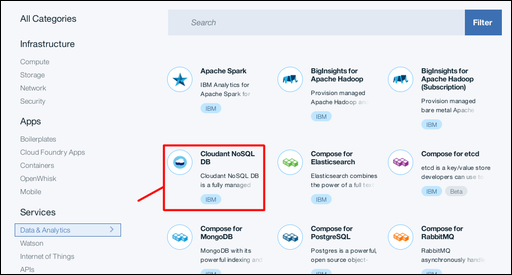
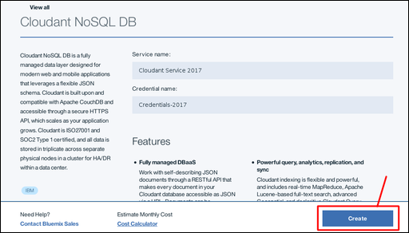
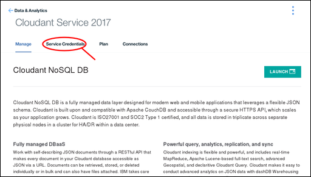
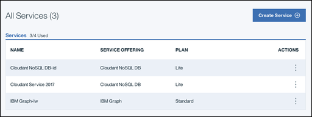

---

copyright:
  years: 2015, 2016
lastupdated: "2016-12-13"

---

{:new_window: target="_blank"}
{:shortdesc: .shortdesc}
{:screen: .screen}
{:codeblock: .codeblock}
{:pre: .pre}

# Creating a Cloudant instance on Bluemix

This tutorial shows you how to create a {{site.data.keyword.cloudantfull}}
service instance on {{site.data.keyword.Bluemix_notm}},
and shows you where to find the essential information to enable your applications
to work with the database.
{:shortdesc}

To access a {{site.data.keyword.cloudant_short_notm}} service instance,
you require a set of [Service Credentials](#the-service-credentials).
These are generated as part of the process when you create a service instance.

You can also find these credentials at any time,
by accessing your {{site.data.keyword.cloudant_short_notm}} Cloudant.

1.  Login to your Bluemix account. 
    The {{site.data.keyword.Bluemix}} dashboard can be found at: [http://bluemix.net](http://bluemix.net){:new_window}.
    After you have successfully authenticated by entering your username and password,
    you are presented with the {{site.data.keyword.Bluemix_notm}} dashboard: 
    

2.  Click the `Catalog` link: 
     
    This bring up a list of the services available on {{site.data.keyword.Bluemix_notm}}.

3.  Select the `Data & Analytics` entry under the `Services` heading: 
     
    This bring up a list of the Data & Analytics services
    available on {{site.data.keyword.Bluemix_notm}}.

4.  Select the {{site.data.keyword.cloudant_short_notm}} service: 
    

5.  In the service configuration panel,
    enter a service name and a credential name.
    In this example,
    the service name is `Cloudant Service 2017`,
    and the credential name is `Credentials-2017`: 
    

6.  By default,
    the service is created using the 'Lite' pricing plan,
    which is free but offers limited capacity.
    Other pricing plans,
    with greater capacity,
    [are available](../offerings/bluemix.html). 
    To create the service,
    click the `Create` button: 
    

7.  A service page appears,
    confirming that your new {{site.data.keyword.cloudant_short_notm}} service is available.
    To access the connection information your application needs to connect to the service,
    click the `Service Credentials` tab: 
    

8.  The Service Credentials panel appears.
    To see the credentials required to access the service,
    click the `View Credentials` dropdown: 
    

9.  The Service Credentials details appear: 
    

## The service credentials

>   **Note**: The service credentials are valuable.
    If anyone or any application has access to the credentials,
    they can effectively do whatever they want with the service instance,
    for example creating spurious data,
    or deleting valuable information.
    Protect these credentials carefully.

The service credentials are in a JSON document,
consisting of five fields:

Field      | Purpose
-----------|--------
`host`     | The hostname used by applications to access the service instance.
`username` | The username required for applications to access the service instance.
`password` | The password required for applications to access the service instance.
`port`     | The HTTP port number for accessing the service instance on the host. Normally 443 to force HTTPS access.
`url`      | A string aggregating all the other credential information into a single URL suitable for use by applications.

If you are creating an application to access your service instance,
you need these credentials.

## Locating your service credentials

At any time,
you can find the credentials for a service associated with your account.

1.  Begin by logging in to Bluemix.
    The {{site.data.keyword.Bluemix}} dashboard can be found at: [http://bluemix.net](http://bluemix.net){:new_window}.
    After you have successfully authenticated by entering your username and password,
    you are presented with the {{site.data.keyword.Bluemix_notm}} dashboard: 
    

2.  Scroll down the Dashboard,
    until you reach the section listing all your services: 
    

3.  In this example,
    we want to find the service credentials for the {{site.data.keyword.cloudant_short_notm}}
    service instance we created earlier in the tutorial,
    called `Cloudant Service 2017`.
    Click on the corresponding row: 
    

3.  The Service Credentials panel appears.
    To see the credentials required to access the service,
    click the `View Credentials` dropdown: 
    

4.  The Service Credentials details appear: 
    